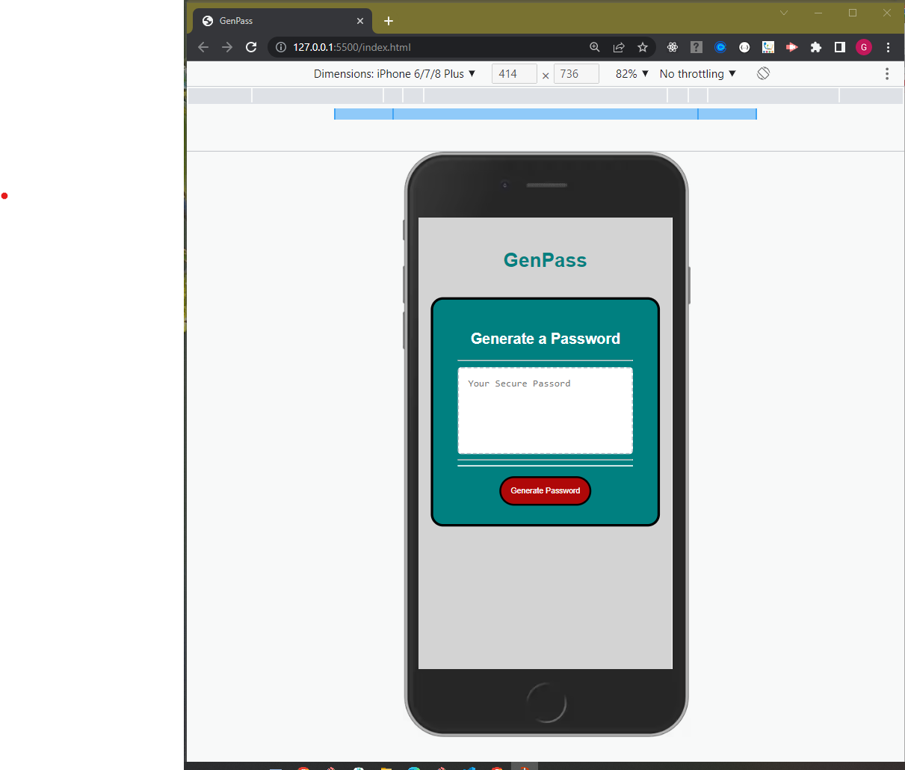
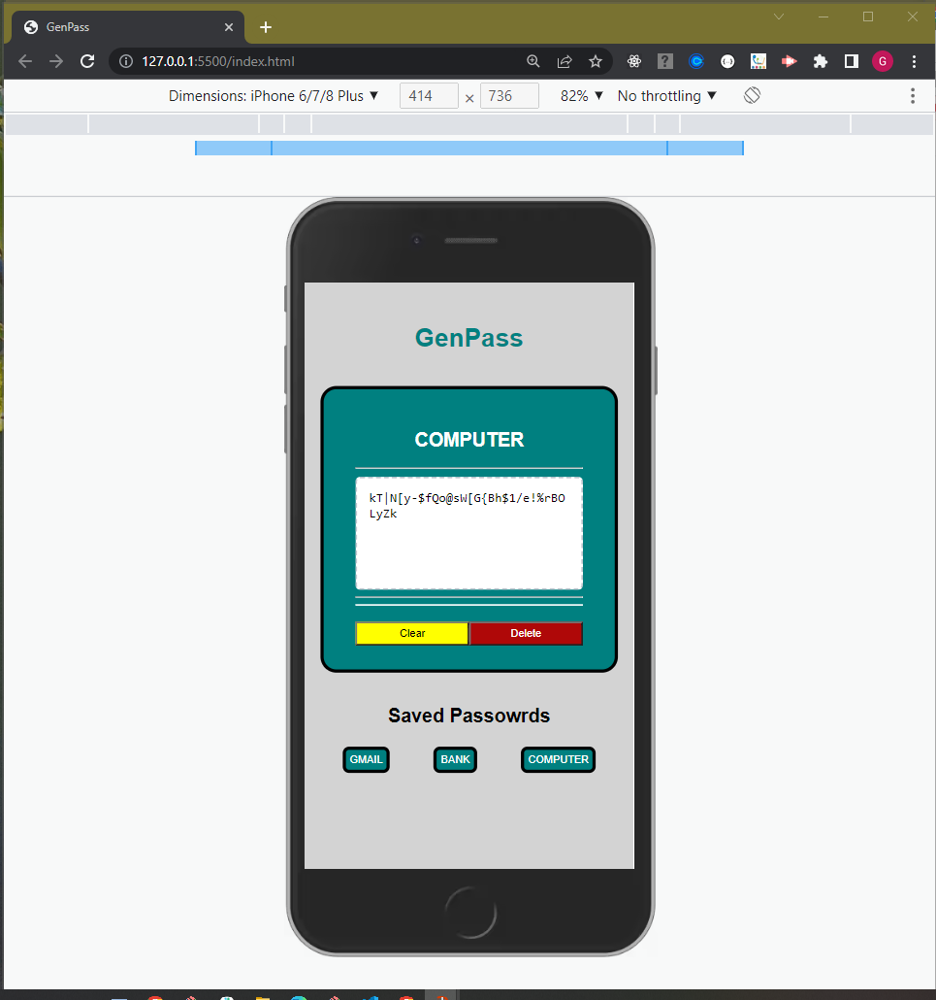
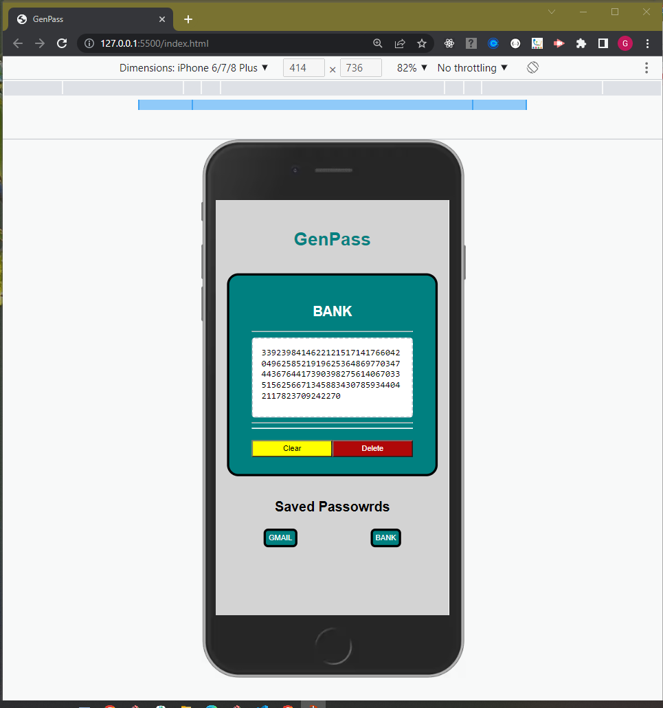
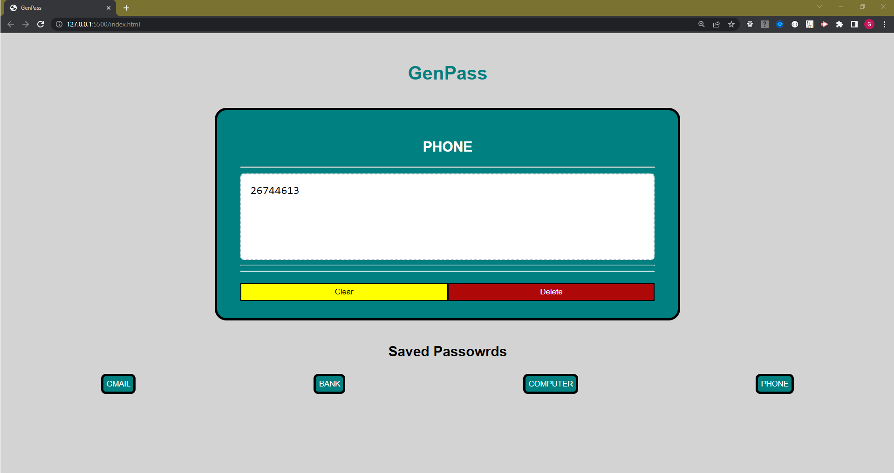
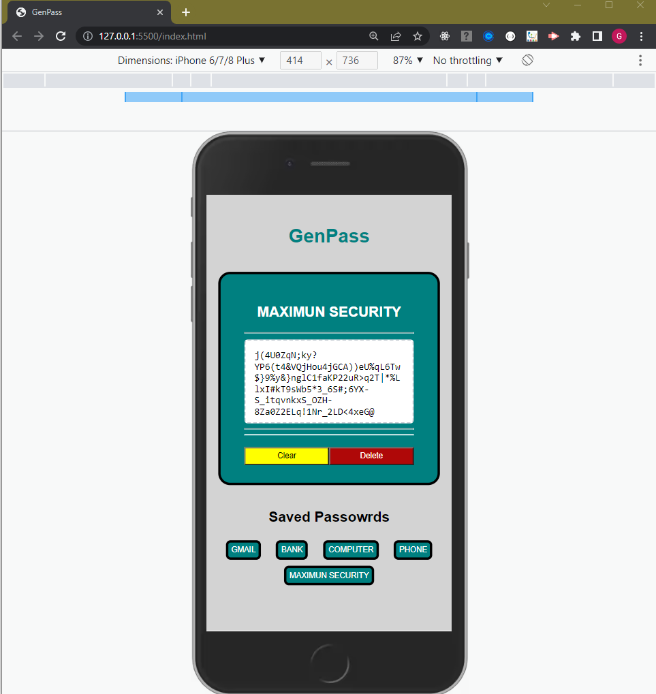

# Password-Generator
Application provides a password management solution.  It generates a random password based on user-selected criteria and stores it for future retrival. This app runs in the browser and feature dynamically updated HTML and CSS powered by JavaScript code. It also features cleaned, polished and responsive user interface.  It adapts to multiple screen sizes.

